<p align="center">
  
</p>

<p align="center">
  <a href="https://vishal-git-dot.github.io/frontend-templates/matchday-jersey-store/matchday-jersey-store.html"></a>
  
  
  
  
  
</p>

<p align="center">
  A single-file, mobile-first storefront template for selling team jerseys — built to load fast,<br>
  scan easily, and turn browsers into buyers in as few taps as possible.
</p>

<p align="center">
  🔗 <a href="https://vishal-git-dot.github.io/frontend-templates/matchday-jersey-store/matchday-jersey-store.html"><strong>View the live demo</strong></a>
</p>

<br>

## 🏟️ What this is

**MatchDay** is a self-contained `.html` storefront template for jersey and fan-gear shops. There's no framework, no build step, and no backend — open the file in a browser and it works. Every team, product, banner, and price lives in one editable config block at the top of the file, so a store owner can re-skin the entire shop without touching markup.

It's built around three things sports shoppers actually want:

- **Speed** — zero image requests (product art is inline SVG), system-first rendering, nothing to compile.
- **Scannability** — a tight product grid, consistent cards, and prices rendered in a scoreboard-style mono pill so they're never ambiguous.
- **Fast conversion** — *Buy Jersey*, *Customize Name & Number*, and one-tap *Order via WhatsApp* on every product and in the cart.

<br>

## ✨ Features

| | |
|---|---|
| 🟥 **Sticky league filters** | Thumb-friendly horizontal pills — All / Football / Cricket / Basketball — filter the whole page instantly. |
| 🧭 **Type & price filter sheet** | A dedicated filter sheet narrows by jersey type (Home/Away/Player Edition/Training/Kids) and price range; active filters show as removable chips above the grid, with a notification dot on the Filters button. |
| 🟨 **New Arrivals & Team rails** | Horizontal scroll-snap rails keep fresh drops and team browsing above the fold. |
| 🟩 **Quick-view sheet** | Tapping any jersey opens a bottom sheet (centered modal on desktop) with size selection, quantity, and live preview. |
| ✍️ **Name & number customizer** | A toggle reveals name/number fields and redraws the jersey art live, with a clear price add-on. |
| 💬 **WhatsApp quick order** | Every product and the cart can check out straight into a pre-filled WhatsApp message — no payment gateway required to start taking orders. |
| 🧮 **Scoreboard pricing** | Prices render in a tabular mono pill (`₹2,499`) so a grid of products stays easy to compare at a glance. |
| 📱 **Bottom tab bar on mobile** | Native-app-style navigation in the thumb zone; replaced by a normal header nav from tablet width up. |
| ⌨️ **Keyboard & focus support** | Every sheet (quick-view, cart, filters) traps Tab focus while open, closes on Escape, and returns focus to whatever triggered it. |
| 🎛️ **One config object** | Brand name, currency, WhatsApp number, banners, leagues, teams, products, and footer links all live in a single `STORE` object. |

<br>

## 📂 Project structure

```
.
├── matchday-jersey-store.html   # the entire storefront — markup, styles, logic, config
├── assets/
│   └── readme-banner.svg        # animated banner used at the top of this file
└── README.md
```

> Rename `matchday-jersey-store.html` to `index.html` if you're deploying it as a static site (GitHub Pages, Netlify, Vercel, or any plain web host all work with zero configuration).

<br>

## 🚀 Getting started

**Try it instantly:** [vishal-git-dot.github.io/frontend-templates/matchday-jersey-store/matchday-jersey-store.html](https://vishal-git-dot.github.io/frontend-templates/matchday-jersey-store/matchday-jersey-store.html)

To run it yourself, no installation or dependencies needed.

```bash
# just open it
open matchday-jersey-store.html        # macOS
start matchday-jersey-store.html       # Windows
xdg-open matchday-jersey-store.html    # Linux
```

Or serve it locally if you'd rather browse it at `localhost`:

```bash
python3 -m http.server 8000
# then visit http://localhost:8000/matchday-jersey-store.html
```

<br>

## 🎨 Customize the store

Everything below lives in the `STORE` object near the top of the HTML file — edit values and reload, no rebuild required.

```js
const STORE = {
  brand: {
    name: "MATCHDAY",
    currency: "₹",
    whatsappNumber: "919999999999",   // country code + number, no symbols
    freeShippingNote: "Free shipping on orders over ₹2,999 …"
  },
  footerLinks: { shippingReturns: "#", sizeGuide: "#", trackOrder: "#", aboutUs: "#", contact: "mailto:hello@matchday.example" },
  banners: [ /* hero carousel slides */ ],
  leagues: [ /* filter pills */ ],
  teams:   [ /* id, name, league, primary + secondary colors */ ],
  products:[ /* team, type, player, number, price, mrp, badge, sizes */ ]
};
```

| Want to change… | Edit… |
|---|---|
| Shop name, currency, WhatsApp number | `STORE.brand` |
| Hero carousel slides | `STORE.banners` |
| League filter pills | `STORE.leagues` |
| Team names & kit colors | `STORE.teams` |
| Products, prices, badges, sizes | `STORE.products` |
| Footer page links | `STORE.footerLinks` |
| Color palette, fonts, spacing | the CSS custom properties in `:root` |

Product art is generated as inline SVG from each team's `primary`/`secondary` colors — swap in real product photography later by replacing the `jerseyArt()` calls with an `` tag, no other logic needs to change.

> Jersey **types** (Home/Away/Player Edition/…) shown in the filter sheet are pulled automatically from whatever values appear in `STORE.products` — add a new type to a product and it shows up as a filter chip with no extra wiring. **Price brackets** are defined in the `PRICE_OPTIONS` array near the top of the script section, just below `STORE`, if you want different ranges than Under ₹2,000 / ₹2,000–₹3,000 / Above ₹3,000.

<br>

## 🔍 Browsing & filtering

- **League pills** (sticky, top of page) narrow by sport.
- **Team rail** narrows further to one team; tap it again to clear.
- **Search** matches team, player, and jersey type as you type.
- **Sort** reorders by newest or price.
- **Filters** opens a sheet for jersey **type** and **price range** — applied filters appear as removable chips above the grid, and a red dot on the Filters button shows when something's active.
- The header's **Player Editions** link is a shortcut that jumps straight to the grid pre-filtered to that type.

<br>

## 🛒 How an order flows

1. Shopper taps a jersey → **quick-view sheet** opens with size options.
2. Optionally toggles **Customize Name & Number** — live preview updates, a flat fee is added.
3. **Add to Cart** keeps browsing, or **Order via WhatsApp** jumps straight into a pre-filled message for that one item.
4. The cart sheet lists everything added and offers **Checkout on WhatsApp**, which builds one message listing every line item and the total.

No payment integration is wired up by design — this template is meant to get a store *taking orders fast*, with checkout-by-chat as the default and a real payment gateway as a later upgrade.

<br>

## 📱 Responsive behavior

| Breakpoint | Layout |
|---|---|
| `< 640px` (phone) | 2-column grid, bottom tab bar, header nav hidden |
| `≥ 640px` (large phone / small tablet) | 3-column grid |
| `≥ 768px` (tablet) | Header nav replaces bottom tab bar, quick-view becomes a centered modal |
| `≥ 1000px` (desktop) | 4-column grid, 4-column footer |

<br>

## 🧰 Built with

Plain HTML, CSS (custom properties, grid, scroll-snap), and vanilla JavaScript — no frameworks, no bundler, no `node_modules`. Fonts are loaded from Google Fonts (`Anton`, `Inter`, `Space Mono`) with `font-display: swap` so text never blocks render.

<br>

## 🧪 Known limitations

This is a frontend template, not a finished production store. By design, it does **not** include:

- A real backend, database, or payment gateway — checkout happens by handing off to WhatsApp, not a payment processor.
- Order or cart persistence — refreshing the page clears the cart. Add `localStorage` or your own backend if you need it to survive a refresh.
- Real product photography — jerseys are inline SVG art generated from each team's colors, not photos.

It's been checked structurally (valid HTML nesting, no duplicate IDs, both inline scripts parse cleanly) and tested live on the [GitHub Pages demo](https://vishal-git-dot.github.io/frontend-templates/matchday-jersey-store/matchday-jersey-store.html) above, where a real desktop-width sheet-visibility bug was caught and fixed. Cross-device and cross-browser coverage still isn't exhaustive, though — if something looks off on your screen, open an issue (or just send a screenshot) and it's almost certainly a quick CSS fix.

<br>

## 📄 License

Provided under the MIT License — use it, re-skin it, ship it. Swap in your own team data, branding, and product photography to launch your own store.

<br>

<p align="center"><sub>Built for fans who'd rather be wearing the kit than waiting for a page to load.</sub></p>
